# GitCode Actions 测试报告

## 背景介绍
GitCode Action是GitCodo 平台开发的对标Github Action的流水线平台，是26年计算开源社区工程能力提升的关键依赖，系统原计划2026 630晚上核心功能上线，730交付计算各开源社区使用

为确保各业务顺利进行流水线改造和适配，计算OSDT 开源基础设施团队于2026 7/13-7/25 对GitCode Action交付的功能进行的初步验收测试

## 关键问题概览
- 严重的安全风险：step中的敏感信息会被汇总到step summary中等
- 各社区CI依赖的核心功能未满足：

| 序号 | 问题场景 | 依赖社区 |
|--|---|---------|
|1| 按路径触发workflow功能不支持 | openEuler，openGauss，MindSpore |
|2| CI中通过permission授权临时token，调用API | 所有社区 |
|3| continue-on-error=true——job 功能不可用，CI无法快速失败 | 所有社区 |
|4| cache 功能在人工触发场景无法使用  | 所有社区 |
|5| 官方提供的资源池只能以 root 用户运行 | openEuler |
|6| 通过自定义资源接入的任务，不支持自定义镜像 | 所有社区 |
|7| NPU资源接入后，无法正常调度 | 昇腾领域各社区 |
|8|	跨仓复用workflow_call不支持 | openUBMC，openEuler |

### 整体结论
测试不通过，GitCode Action 在核心功能和安全上存在风险和缺陷，无法满足计算开源社区的工程诉求和安全要求**

### 后续要求
对已发现的问题启动举一反三，确保问题收敛，并提供完整的验收报告和规格说明

## 问题详情
### 测试概览

| 结论口径 | 数量      | 占比（剔除不可测试后） |
|---|---------|-------------|
| 检测通过 | 456     | 91.5%       |
| 产品缺陷 | 42      | 8.4%        |
| **合计** | **498** | —           |

## 问题摘要

| 问题分类 | 数量     |
|---------|--------|
| P0 | 14     |
| P1 | 3      |
| P2 | 9      |
| P3 | 16     |
| **合计** | **42** |

### 问题清单

| 序号 | 预期和问题现象 | 日志链接 | 严重等级 | 类型 | 是否解决 | 业务影响 |
|---|------------|---------|---------|-----|--------|---------|
|1|预期：多个任务同时提交，排队后运行 现象：任务一直排队没有执行|https://gitcode.com/ComputingActionTest/bingo/actions/runs/a88697b8e4d2414ebcde1f1d070e3059  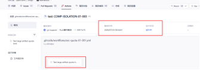|P0|功能|解决|业务影响大，该bug可能会导致任务长期挂在workflow中，且用户难以感知|
|2|预期: 父job为matrix job,父job成功后，依赖父job的子job启动成功 现象: 父job为matrix job,父job成功后，依赖父job的子job启动失败 |https://gitcode.com/LiYanghang00/demo/actions/runs/619b223e435e4755820ed1b2e49c8ec1|P0|功能|解决|业务影响大，矩阵构建镜像为高频功能，不支持会导致使用不方便|
|3|预期：使用官方提供的资源池，使用自定义镜像时，指定用户执行 现象：指定用户不生效|https://gitcode.com/ComputingActionTest/bingo/actions/runs/c86a28f0530d4560a72da7aca162a90f/job/0841b6a7ec604ee8b6c56638c717e847|P0|功能||业务影响大，openEuler社区镜像会指定用户去执行|
|4|预期：项目支持200job并发 现象：并发到100后，部分任务出现申请资源失败的情况|https://gitcode.com/ComputingActionTest/bingo/actions/runs/311dff2064a44280a46dc8f3ac6c0c0d/job/263d87da996e4b6489e0ccf169d80cc6|P0|资源||业务影响大，opneEuler，openGauss瞬时并发190+|
|5|预期：可支持昇腾卡 现象：不支持||P0|资源||业务影响大，Ascend和mindspore等社区的CI都需要npu机器去执行用例|
|6|预期：Secret 不经 artifact 外泄 现象：Secret 经 artifact 外泄|https://gitcode.com/ComputingActionTest/foundational-tests/actions/runs/e372cfd4a131418cb1b00432a217ff8f/job/19962f85c3be4d7cb165bf8a67a94302|P0|安全||业务影响大，部分密钥可能会持久化到本地，如GITHUB_TOKEN 会写入本地 Git 配置文件中（.git/config），配置如果被打包上传成功会造成密钥泄露|
|7|预期：cache support workflow_dispatch 现象：cache doesn't support workflow_dispatch|https://gitcode.com/ComputingActionTest/foundational-tests/actions/runs/a7da7c441a0f47f184fd149e210bc7ad/job/fa326659fc2e4be688f4868b85f5675d|P0|功能||业务影响大，仅支持push\|pull_request\|merge_request， 实际业务中常有定时任务用于构建，回归测试，手动触发评论触发用于重试，不支撑cache影响使用效率|
|8|预期：父workflow传入secrets参数后，workflow中正常获取 现象：父workflow传入secrets参数后，workflow中无法获取|https://gitcode.com/ComputingActionTest/mamual-case-3/actions/runs/247672fa902944279e6acccd2733b764/job/66704058e934432da726b75bd11eb413|P0|功能||业务影响大，入参无法在子workflow获取，无法在子workflow中进行推送代码，涉及业务门禁中 push镜像等操作|
|9|预期：声明 repository write 后 TOKEN 可推送代码 现象：声明 repository write 后 TOKEN 不可推送代码|https://gitcode.com/ComputingActionTest/foundational-tests/actions/runs/3891a055808d4f5d8989b96fbeb5240c/job/01cb1986b9114777a52acaf09f531feb|P0|功能||业务影响大，手动触发不支持配置写入权限，会造成一些有push权限的workflow无法手动重试|
|10|预期：continue-on-error=true——job 失败后 workflow 不应终止 现象：continue-on-error=true——job 失败后 workflow 终止了|https://gitcode.com/ComputingActionTest/bingo/actions/runs/a1d6ccbbd92f4da796efa94f1c4d1931|P0|功能||业务影响大，该bug可能会使一些任务不再执行，影响进度|
|11|预期：定时任务触发 现象：Scheduler 不工作：两个仓库、多次 cron 配置，从未产生 Schedule Run。文档声明的定时触发、cron 运算符、UTC 时区、默认分支、最小间隔等全部无法验证|https://gitcode.com/ComputingActionTest/gitcode-test-5/actions/runs/ce44b8d3c5dd464e936915d340ab491a|P0|功能|解决|业务影响大，定时任务为常用功能|
|12|预期：Secret 值在 step summary 和错误堆栈中必须被脱敏 现象：Secret 值在 step summary 和错误堆栈中必须wei被脱敏|https://gitcode.com/ComputingActionTest/manual-case/actions/runs/c0f21654742b45a58b14e088a53945fc|P0|安全||业务影响大，部分密钥可能会打印到日志中，造成密钥泄露|
|13|预期：uses: 使用SHA能正常运行 现象：uses: 使用SHA的时候不行8dcbefdddbf8e4e26bfe8502c28e42a6b92ee43b|https://gitcode.com/ComputingActionTest/bingo/actions/runs/d8aa9047389e46f1bf04d0b4533ccddb/job/16f1b1bb2635459695717ba9295e64a6|P0|安全|已解决|业务影响中，如果使用第三方插件，会有安全风险|
|14|预期：修改 tc-tests/api/** 路径的 PR 应触发独立 Job。 现象：满足 paths 条件的 PR 变更没有对应 workflow 运行。|https://gitcode.com/LiYanghang00/demo/pull/26|P0|功能||业务影响大，open系列社区中有文档校验门禁，需要指定路径触发|
|15|预期：Action 中使用token调用 API，发布 PR 检查结果评论。 现象：使用action内置token调用api报403|https://gitcode.com/ComputingActionTest/bingo/actions/runs/1e8ce20d155d478dbaa406b3923aa25f/job/45235fca13a24dbc9d32a991080f70a1|P0|功能||业务影响大，CI门禁中需要使用token调用接口打标签，评论|
|16|预期：变量注入 Runner"和"env > vars"优先级链 现象：Runner 不注入 Job env 到 Shell：表达式层 ${{ env.VAR }} 正常但 Bash $VAR 恒为 UNSET|https://gitcode.com/ComputingActionTest/gitcode-test-6/actions/runs/28f4d906b7b7484b856ab55262d51758  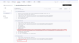|P1|功能||业务影响大，用户无法注入环境变量|
|17|预期：pr页面上显示对应的action 现象：页面没有显示action|  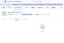|P1|功能|解决|业务影响小，PR详情中能看到对应的action|
|18|预期：workflow_call 嵌套 2 层时应正常执行 现象：workflow_call 嵌套 2 层时，没有日志，显示调用成功|https://gitcode.com/ComputingActionTest/mamual-case-3/actions/runs/e867aa6ae34f452c94e6f0ed53cd9b89/job/7ccce124d35d4e24bab0689180eada1e|P1|功能||业务影响大，不支持多层嵌套复用workflow，容易复制粘贴，更多的相似代码，带来的维护难题|
|19|预期：concurrency.max=5 限制最多 5 条并发，超出排队 实际：①未写 enable:true → 20 条全并行 71s 跑完；②补 enable:true → T+10s 仍 11 条同时 RUNNING，max=5 不生效 结论：文档承诺但平台未实现——即使 enable:true 也不限流|https://gitcode.com/ComputingActionTest/gitcode-test-5/actions/runs/f78cfa0045284c6b8b21cc97bb184ffd（harness 单次）、https://gitcode.com/ComputingActionTest/gitcode-test-5/actions/runs/464f2352a3bf46e4a412b0a9e568b2a3 ~ e73da6fb4b7248c190d8c606546a8ef2（20 条压测）  |P2|功能||业务影响中，不影响当前任务执行，但限流机制失效，会导致资源被抢占|
|20|预期：workflow 运行完后，能看到对应的yaml 现象：workflow 运行时 看不了yaml|https://gitcode.com/ComputingActionTest/gitcode-test-1/actions/runs/f1bdbb5f59134248b3b68a0def2438b3/workflow|P2|功能||业务影响中，易用性问题|
|21|预期：ATOMGIT_ACTIONS_ALLOW_UNSECURE_COMMANDS返回正常 现象：ATOMGIT_ACTIONS_ALLOW_UNSECURE_COMMANDS 默认值缺失|https://gitcode.com/ComputingActionTest/gitcode-test-6/actions/runs/72d6a488ba1642c893cb605be0757722  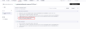|P2|功能||业务影响无，暂无业务用到这个变量|
|22|预期：能正常调用 hashFiles 函数 现象：调用失败|https://gitcode.com/ComputingActionTest/bingo/actions/runs/8f9757250850424282a9437d51926296/job/6a86b806bf084996a6746628c3d03103|P2|功能||业务影响小，可以自己实现相关功能|
|23|预期：small runner 写入 49 GB 应成功 现象：写入到约 37.9 GB 时磁盘满，job 以 exit code 1 失败|https://gitcode.com/ComputingActionTest/bingo/actions/runs/6212d04153e946af8da8802f3316961d  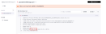|P2|功能||业务影响小，后续使用自定义机器|
|24|预期：系统变量 ATOMGIT_REPOSITORY_OWNER 注入 Runner 现象：ATOMGIT_REPOSITORY_OWNER为空|https://gitcode.com/ComputingActionTest/bingo/actions/runs/47d694ffa57146a982c45c64969b4736/job/0bb282d6dbca4de79868a3ca80fbd102|P2|功能||业务影响无，暂不涉及|
|25|预期：条件执行函数能使用 现象：条件执行函数 校验报错||P2|功能|已解决|业务影响中，ascend中有一些门禁根据前一个步骤失败执行的|
|26|预期：ref=refs/heads/main 现象：ref=main|https://gitcode.com/ComputingActionTest/gitcode-test-3/actions/runs/296c72cb31f14133ad1807a5d3c0da94|P2|功能||业务影响小，编写yaml的需注意|
|27|预期：使用 github 上下文时报错应提示 atomgit 替代 现象：github.ref` 被解析为 `placeholder_ref|https://gitcode.com/ComputingActionTest/gitcode-test-4/actions/runs/07faabc52d364cd5889414aa63c128da|P2|功能||业务影响无，暂不涉及|
|28|预期：setup-java/ setup-python  / setup-go 安装指定版本成功 现象：指定版本失败，其中setup-java不支持，但是官网用例为支持|https://gitcode.com/LiYanghang00/demo/actions/runs/09ac317840694d5c811b5cb33458480a/job/3a832ac334dc43279e678d7c20da805e https://gitcode.com/LiYanghang00/demo/actions/runs/4c15ca5fd58b4ebfa08cb7341a108563/job/e87fb13b8803428fa4ef9c9ab8ccb47e  |P3|文档||业务影响小，指引错误会导致浪费更多时间调试，影响迁移效率|
|29|预期：鼠标悬停有描述 实际：鼠标悬停没有描述|https://gitcode.com/ComputingActionTest/gitcode-test-5/actions/workflows/use-disp-01-003.yml  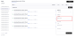|P3|UI||业务影响小，基本不影响任务执行|
|30|预期：dispatch 必填参数缺失时拒绝触发并给出明确错误信息 实际：无 environment 时 HTTP 400，报 "Inputs校验失败"；提供 environment 后 HTTP 200 正常触发，没给出明确错误信息|https://gitcode.com/ComputingActionTest/gitcode-test-5/actions/runs/de75f0441e5949e0af0f3aa092e93103  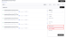|P3|功能|解决|业务影响小，基本不影响任务执行|
|31|预期：permissions: 中有hook权限 现象：校验失败|  |P3|功能||业务影响无，暂不涉及|
|32|预期：任务取消后，图标显示为取消 现象：显示仍然为等待按钮|https://gitcode.com/ComputingActionTest/bingo/actions/runs/421614e6c036448b93676fa007e5da36  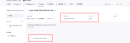|P3|UI||业务影响小，影响用户使用体验|
|33|预期：ui展示正确的workflow状态 现象：ui 显示错误|    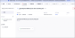|P3|UI||业务影响小，显示错误，影响判断|
|34|预期：状态函数正确运行 现象：success 等状态函数报错|  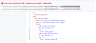|P3|文档|解决，文档没刷新|业务影响小，编写yaml的需注意|
|35|预期：workflow_dispatch inputs 类型限制 — boolean 应报错 现象：没有限制，正常运行|https://gitcode.com/ComputingActionTest/gitcode-test-4/actions/runs/0e732c6244bf4086a6399c73561a4ca7|P3|功能||业务影响小，边缘用例，编写yaml需要注意|
|36|预期：stage为array 现象：stages 反序列化错误 (array vs map)|  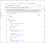|P3|文档||业务影响小，编写yaml的需注意 stages是有序的，使用map表达有序的步骤，与直觉不符，容易造成失误|
|37|预期：post.steps/run_always能通过校验 现象：通不过校验|  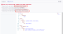|P3|文档||业务影响小，编写yaml的需注意|
|38|预期：job超时后的状态应说明是"FAILED"还是"CANCELLED" 现象：job超时后的状态是"CANCELLED"|https://gitcode.com/ComputingActionTest/bingo/actions/runs/0213fd89e3ff4dbd8155a84fbdbf940d|P3|文档||业务影响小，编写yaml的需注意|
|39|预期：文档应该有artifact 具体大小限制值的规格说明 现象：文档找不到对应的规格说明||P3|文档||业务影响小，避免用户盲测|
|40|预期：PR 状态应返回 open。 现象：GitCode 返回 opened，导致断言失败。|https://gitcode.com/LiYanghang00/demo/actions/runs/eaccbe86e26f4308942bd172fc8da040/job/1ebdf5324f5f432a80cfbf5cb7455ebc|P3|文档||业务影响小，编写yaml的需注意|
|41|预期：文档为 Linux 现象：runner.os 返回 linux|https://gitcode.com/ComputingActionTest/gitcode-test-2/actions/runs/ef8a65b9e5fa4048a4283ec54588d3b4|P3|文档||业务影响小，编写yaml的需注意|
|42|预期：文档为 X64 现象：runner.arch 返回 x86_64|https://gitcode.com/ComputingActionTest/bingo/actions/runs/e2770cb7b3b34bb5818139fc61ce1469/job/eaa772fcfd9645c9b301ed0fe8c7a289|P3|文档||业务影响小，编写yaml的需注意|
|43|预期：重新运行失败任务最大重试次数生效 现象：重新运行失败任务最大重试次数未生效，且页面上没有任何显示次数的提示信息|https://gitcode.com/ComputingActionTest/bingo/actions/runs/55990342a3db438690e6d986290df49e/job/a1150bea0ce643fbb10298757cecae47  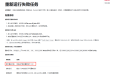|P3|功能||业务影响小，设置的最大次数未生效，若只涉及自动化会无限运行|

## 附录

### 问题等级定义

| 等级 | 定义 |
|------|------|
| **P0** | **核心流程阻断** — 导致用户完全无法完成任务的关键性问题，如创建/运行工作流失败、核心功能不可用、数据丢失、安全泄露等，必须立即修复并发布热修复版本。 |
| **P1** | **主要功能受损** — 严重偏离预期行为，影响用户正常使用流程，但存在临时规避方案；或对部分场景/用户造成阻塞性影响，需在当前迭代内修复。 |
| **P2** | **次要功能异常** — 非核心流程的体验问题、边界 case 异常、文档不准确等，不影响任务完成，计划在后续迭代修复。 |
| **P3** | **建议/优化** — 体验增强、兼容性提升、非功能性改进等，视资源情况安排。 |

### 测试结果定义

| 等级 | 判定标准 |
|----|----------|
| 可用 | 无 P0 问题，P1 问题 < 5 个，且问题占比 < 10% |
| 不可用 | 存在 P0 问题，或涉及核心功能 / 安全 |
